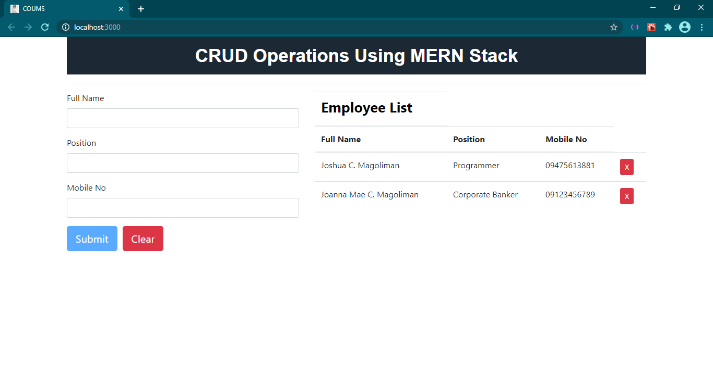

# CRUD OPERATIONS USING MERN STACK

* Purpose: My Project
* Front End: HTML5, LESS, CSS3, Bootstrap, jQuery, React-Toastify, React
* Back End: Express, Node.JS, Mongoose, MongoDB Compass, MongoDB
* Responsive Web Design: Yes
* Type of Website: Dynamic

<h2> User Interface Screenshots </h2> 
  
    
  
	